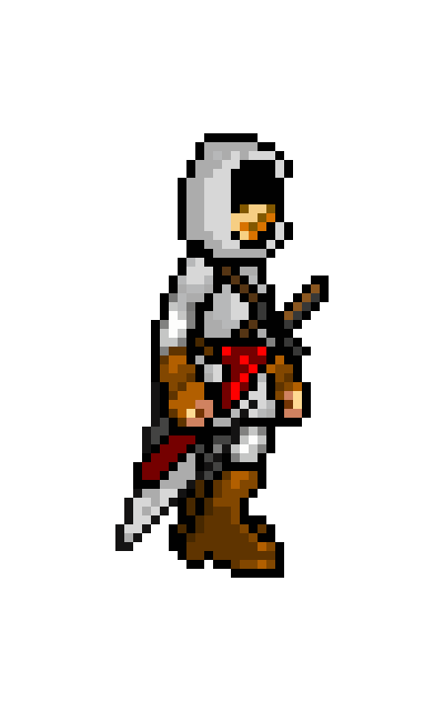
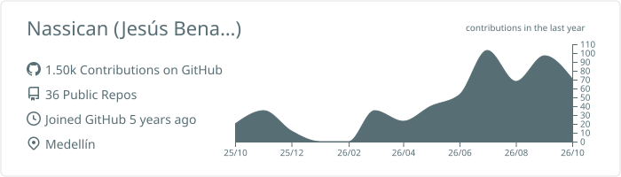
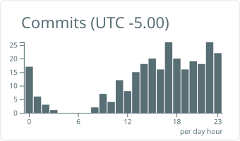

# Hi! 👋 I'm Jesús David Benavides

### Full Stack Developer · Systems Engineer

  
  
  

---

## 🛠️ Tech stack

**Languages**

  
  
  
  

**Frontend**

  
  
  
  

**Backend & databases**

  
  
  
  

**DevOps & tools**

  
  
  
  
  

## 📊 GitHub stats

  <picture>
    <source media="(prefers-color-scheme: dark)" srcset="https://github-stats-extended.vercel.app/api?username=Nassican&show_icons=true&include_all_commits=true&count_private=true&hide_border=true&theme=radical" />
    <source media="(prefers-color-scheme: light)" srcset="https://github-stats-extended.vercel.app/api?username=Nassican&show_icons=true&include_all_commits=true&count_private=true&hide_border=true&theme=default" />
    
  </picture>
  <picture>
    <source media="(prefers-color-scheme: dark)" srcset="https://github-stats-extended.vercel.app/api/top-langs/?username=Nassican&layout=compact&langs_count=7&hide_border=true&theme=radical" />
    <source media="(prefers-color-scheme: light)" srcset="https://github-stats-extended.vercel.app/api/top-langs/?username=Nassican&layout=compact&langs_count=7&hide_border=true&theme=default" />
    
  </picture>
   
  <picture>
    <source media="(prefers-color-scheme: dark)" srcset="https://streak-stats.demolab.com?user=Nassican&hide_border=true&theme=radical" />
    <source media="(prefers-color-scheme: light)" srcset="https://streak-stats.demolab.com?user=Nassican&hide_border=true&theme=default" />
    
  </picture>

## 🏆 GitHub trophies

  <a href="https://github.com/ryo-ma/github-profile-trophy">
  <picture>
    <source media="(prefers-color-scheme: dark)" srcset="https://trophy.ryglcloud.net/?username=Nassican&row=1&column=6&theme=radical" />
    <source media="(prefers-color-scheme: light)" srcset="https://trophy.ryglcloud.net/?username=Nassican&row=1&column=6" />
    
  </picture>
  </a>

## 📈 Activity

  <picture>
    <source media="(prefers-color-scheme: dark)" srcset="./profile-summary-card-output/radical/0-profile-details.svg" />
    <source media="(prefers-color-scheme: light)" srcset="./profile-summary-card-output/default/0-profile-details.svg" />
    
  </picture>
   
  <picture>
    <source media="(prefers-color-scheme: dark)" srcset="./profile-summary-card-output/radical/4-productive-time.svg" />
    <source media="(prefers-color-scheme: light)" srcset="./profile-summary-card-output/default/4-productive-time.svg" />
    
  </picture>

## 💻 Coding time

  <a href="https://wakatime.com/@Nassican">
  <picture>
    <source media="(prefers-color-scheme: dark)" srcset="https://github-stats-extended.vercel.app/api/wakatime?username=Nassican&layout=compact&hide_border=true&custom_title=Coding%20Time%20Weekly&theme=radical" />
    <source media="(prefers-color-scheme: light)" srcset="https://github-stats-extended.vercel.app/api/wakatime?username=Nassican&layout=compact&hide_border=true&custom_title=Coding%20Time%20Weekly&theme=default" />
    
  </picture>
  </a>

## 🐍 Contribution snake

<picture>
  <source media="(prefers-color-scheme: dark)" srcset="https://raw.githubusercontent.com/Nassican/Nassican/output/snake-dark.svg" />
  <source media="(prefers-color-scheme: light)" srcset="https://raw.githubusercontent.com/Nassican/Nassican/output/snake.svg" />
  
</picture>
